# AirBite

AirBite is a full-stack food delivery web application that simulates autonomous drone-based delivery. Users can browse restaurants, add products to a cart, place orders, and track deliveries in real time while the system assigns drones based on package weight and delivery conditions.

[-------------------------------------------------------------------------------------------]

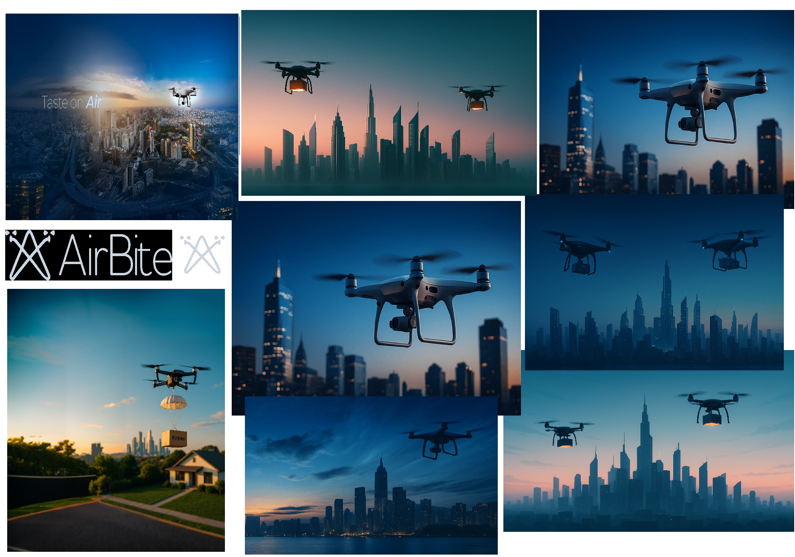

[-------------------------------------------------------------------------------------------]

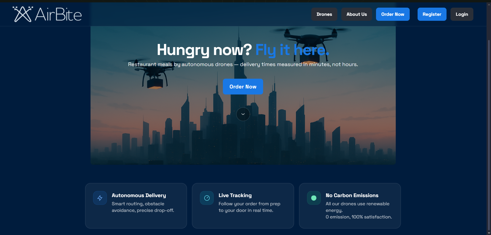

[-------------------------------------------------------------------------------------------]

* Project Overview

The goal of this project was to combine modern web development with a practical logistics concept: food delivery performed by drones instead of traditional drivers. The application demonstrates both customer-facing features and backend delivery logic, including drone assignment, estimated delivery time, and live order tracking.

[-------------------------------------------------------------------------------------------]

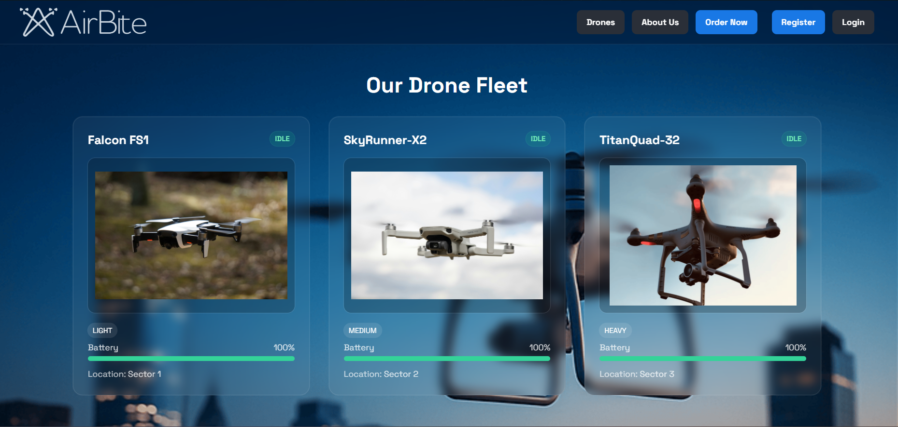

[-------------------------------------------------------------------------------------------]

* Main Features

- Browse restaurants and menus
- Add products to cart and manage quantities
- Place food orders through a simple checkout flow
- Automatic drone assignment based on order requirements
- Estimated delivery time calculation
- Live delivery tracking page with countdown and progress bar
- Drone fleet status page showing drone type, battery, location, and current state
- Automatic drone state updates after delivery completion

[-------------------------------------------------------------------------------------------]

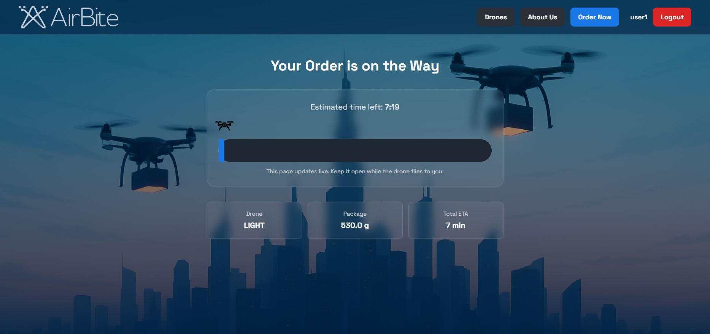

[-------------------------------------------------------------------------------------------]

* Tech Stack

- **Backend:** Java, Spring Boot
- **Frontend:** Thymeleaf, HTML, Tailwind CSS, JavaScript
- **Database:** PostgreSQL
- **Build Tool:** Maven
- **Authentication:** JWT
- **ORM / Persistence:** Spring Data JPA, Hibernate

[-------------------------------------------------------------------------------------------]

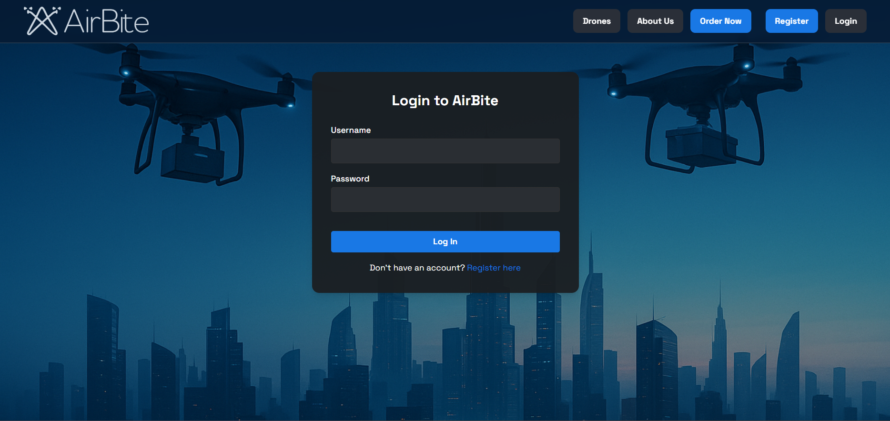

[-------------------------------------------------------------------------------------------]

* Business Logic Highlights

- Orders are evaluated by total package weight
- A suitable drone type is selected automatically
- Delivery ETA is calculated and shown to the user
- While an order is active, the assigned drone changes state to `DELIVERING`
- When the delivery is completed, the drone returns to `IDLE`
- Drone battery level is tracked and displayed in the fleet view

[-------------------------------------------------------------------------------------------]

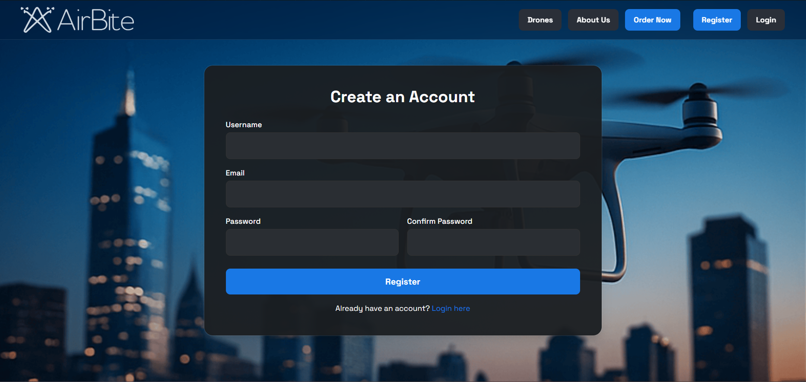

[-------------------------------------------------------------------------------------------]

* Pages Included

- Home page
- Restaurant listing
- Menu / ordering flow
- Order summary
- Order confirmation
- Live order tracking
- Drone fleet overview

[-------------------------------------------------------------------------------------------]

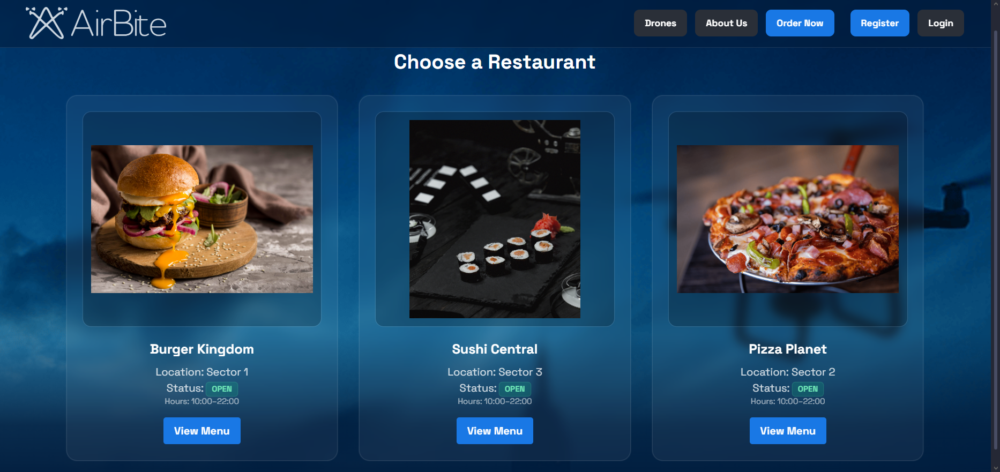

[-------------------------------------------------------------------------------------------]

* Project Purpose

This project was created as a portfolio application to demonstrate:
- full-stack application structure
- backend business logic
- database integration
- frontend and backend communication
- debugging and iterative improvement
- real-world inspired system design

[-------------------------------------------------------------------------------------------]

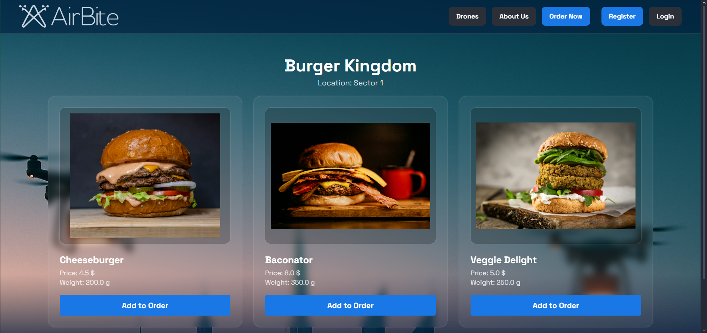

[-------------------------------------------------------------------------------------------]

* Current Status

The application is functional as a prototype/portfolio project. Core ordering, tracking, and drone status behavior are implemented, including fixes for UI refresh issues where drones now correctly update back to `IDLE` after delivery.

* Repository Contents

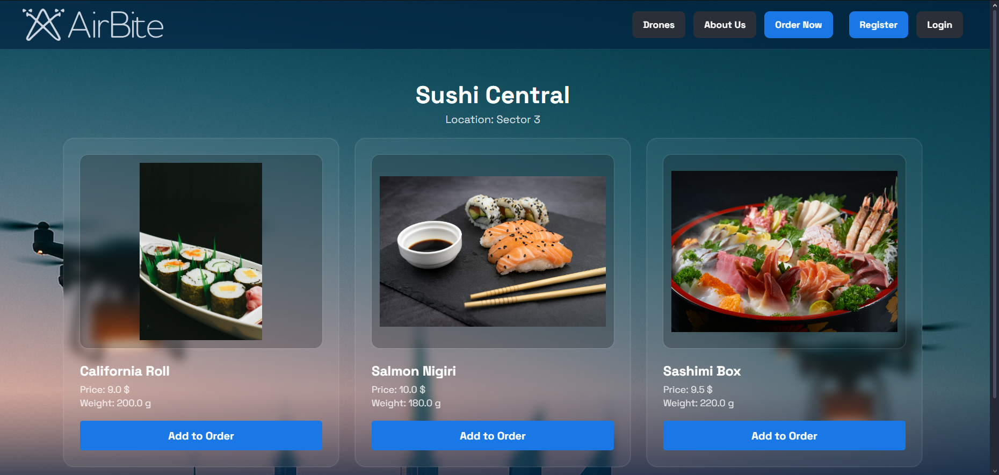

This repository may include:
- source code
- screenshots/images from the project
- project presentation PDF
- selected code snippets
- supporting documentation

[-------------------------------------------------------------------------------------------]

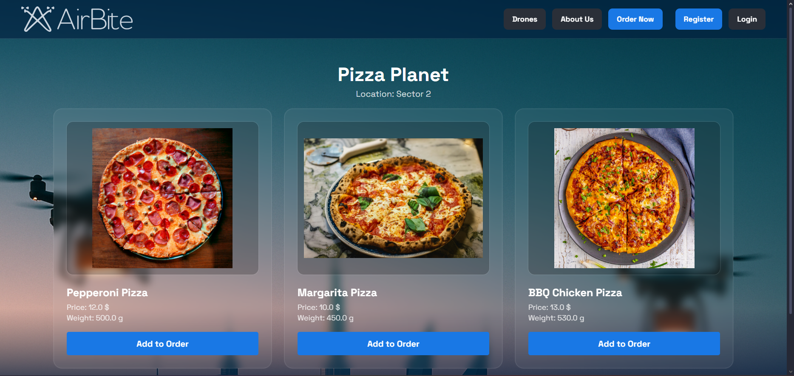

[-------------------------------------------------------------------------------------------]

* Future Improvements

- Admin dashboard for managing drones, restaurants, and orders
- Better real-time updates with WebSockets
- Improved battery consumption simulation
- Route optimization logic
- Role-based authentication
- Enhanced responsive design
- Deployment to a public hosting platform

[-------------------------------------------------------------------------------------------]

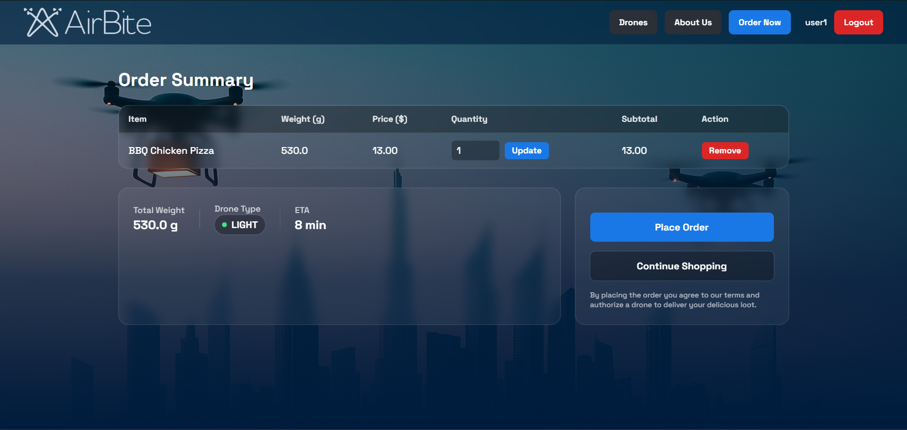

[-------------------------------------------------------------------------------------------]

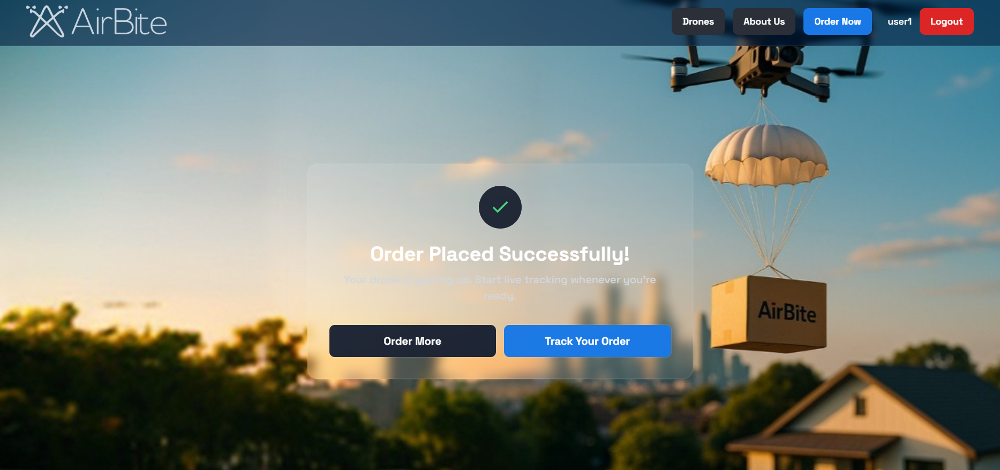

[-------------------------------------------------------------------------------------------]

## Special Thanks

Special thanks to **Alina R.** for her valuable creative input throughout the project.  
She designed the **logo**, helped define how the **pages should look**, contributed to the **UI direction**, and shared ideas for **animations** and visual flow. 
Her eye for design helped shape the overall style and presentation of AirBite.

 ## Author

Created by **B. Botond** as part of a portfolio and learning journey in Java backend development, QA, and full-stack application building. 

## Credits & Copyright

[-------------------------------------------------------------------------------------------]

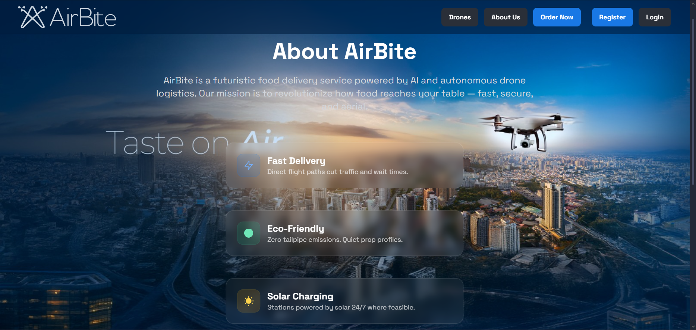

[-------------------------------------------------------------------------------------------]

[-------------------------------------------------------------------------------------------]

[-------------------------------------------------------------------------------------------]

[-------------------------------------------------------------------------------------------]

Project concept, implementation, and documentation by **B. Botond**.  
UI and visual design contributions by **Alina R.**.

© 2026 Botond. All rights reserved unless otherwise specified.
